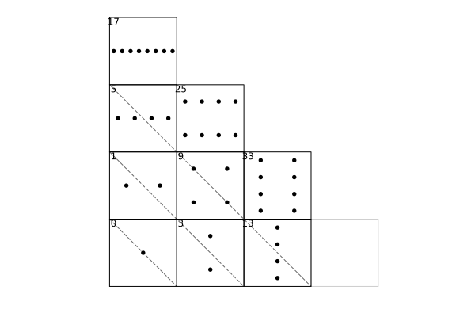
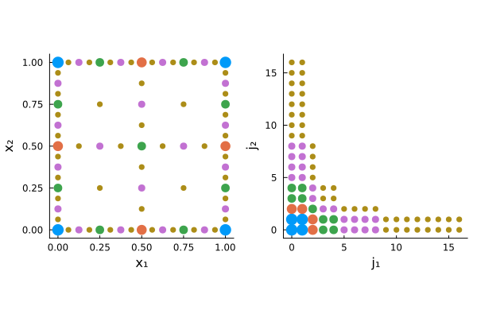

# UnifiedSparseGrids.jl

[](https://github.com/redblackbst/UnifiedSparseGrids.jl.jl/actions/workflows/documentation.yml) [](https://redblackbst.github.io/UnifiedSparseGrids/dev/) [](https://redblackbst.github.io/UnifiedSparseGrids/stable/) [](LICENSE)

UnifiedSparseGrids.jl is a Julia package for **regular sparse-grid data structures, transforms, and matrix-free tensor operators** built around

- nested 1D **axis families**,
- downward-closed **refinement-index sets** (notably Smolyak, weighted Smolyak, and full tensor), and
- explicit coefficient layouts with deterministic traversal.

It is aimed at interpolation / approximation workflows as well as sparse-grid Galerkin experiments where you want direct control over layouts, transforms, basis changes, and matrix-free operator application.

## Highlights

- **Refinement-index sparse grids**: isotropic Smolyak, weighted Smolyak, and full tensor index sets.
- **Axis families with explicit growth rules**: e.g. Chebyshev--Gauss--Lobatto, dyadic, and periodic Fourier axes.
- **Explicit coefficient layouts**:
  - `RecursiveLayout()` for unidirectional sweeps,
  - `SubspaceLayout()` for blockwise algorithms,
  - explicit conversions between them.
- **Unidirectional tensor sweeps** for
  - hierarchization / dehierarchization,
  - nodal--modal transforms,
  - basis changes,
  - matrix-free tensor operators.
- **Composable operator interfaces**:
  - define 1D line operators,
  - lift them to tensor operators,
  - compose full sweeps,
  - use sparse-grid-safe up/down splitting when a 1D operator needs triangular decomposition.
- **Evaluation and cross-grid transfer tools**: `evaluate`, `plan_evaluate`, `restrict!`, `embed!`.
- **Thread-aware cyclic sweep engine** with reusable plans and allocation-aware kernels.

## Figures

### Subspace (block) layout

Rectangles are subspaces (tensor-product blocks) and labels are 0-based offsets in the concatenated subspace layout.



### Sparse grid and its index set

A 2D sparse grid point set (left) and its corresponding refinement-index set (right).



## Installation

Until the package is registered, install it directly from GitHub:

```julia
import Pkg
Pkg.add(url="https://github.com/redblackbst/UnifiedSparseGrids.jl")
```

Once registered, `Pkg.add("UnifiedSparseGrids")` will work as usual.

## Quick start

Construct a 2D Smolyak grid with Chebyshev--Gauss--Lobatto axes and sample a function on sparse-grid points (ordered consistently with `traverse(grid)`):

```julia
using UnifiedSparseGrids

D = 2
L = 4
axes = ntuple(_ -> ChebyshevGaussLobattoNodes(), Val(D))
I = SmolyakIndexSet(D, L)
grid = SparseGrid(SparseGridSpec(axes, I))

vals = evaluate(grid) do x
    exp(-sum(abs2, x))
end
```

Traverse the same grid in different coefficient layouts:

```julia
it_rec = traverse(grid; layout=RecursiveLayout())
it_sub = traverse(grid; layout=SubspaceLayout())

first(it_rec), first(it_sub)
```

## Examples

See the [`examples/`](examples/) directory and the documentation tutorials:

- `gradinaru_2007_tdse.jl`: Strang splitting for the time-dependent Schrödinger equation using sparse-grid Fourier transforms.
- `shen_yu_2010_sec4.jl`: Sparse spectral Galerkin solve for a high-dimensional elliptic problem using composed tensor operators.
- `balder_zenger_1996_helmholtz.jl`: Hierarchical-hat discretization for a Helmholtz-type operator with matrix-free line operators.

## Documentation

- [Development documentation](https://redblackbst.github.io/UnifiedSparseGrids.jl/dev/)
- [Stable documentation](https://redblackbst.github.io/UnifiedSparseGrids.jl/stable/) (published after the first tagged release)
- Documentation source and build configuration: [`docs/`](docs/)

## License

Distributed under the [MIT License](LICENSE).
